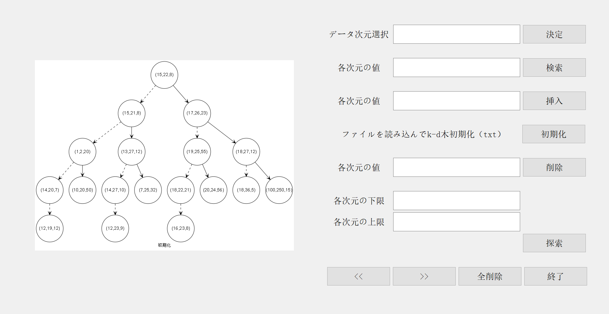

## K-D木プロジェクト
### 概要
K-Dツリー（k-dimensional tree）は、多次元空間におけるデータを効率的に格納・検索するための二分探索木です。各ノードはk次元のポイントを保持し、特定の次元に基づいて左右の子ノードに分割されます。これにより、範囲検索や最近傍探索（Nearest Neighbor Search）などの操作が高速に行えるようになります。特に機械学習やコンピュータグラフィックス、地理情報システムなどで広く利用されています。<br>

このシステムを使用するには、Qt（v5.9.0）とGraphviz（v3.0.0）が必要です。<br>
Graphvizは https://graphviz.org/download/ から、Qtは https://download.qt.io/archive/qt/ からダウンロードできます。

---

### ファイル
```text
KDTree/
├── myQt/
     ├── build-experiment1-Desktop_Qt_5_9_0_MinGW_32bit-Debug/
     └── experiment1/
            ├── main.cpp    // プログラムのエントリーポイント、Qtアプリケーションを初期化しメインウィンドウを表示
            ├── tree.h      // k-dツリーのデータ構造とアルゴリズム（挿入、削除、検索、可視化）
            ├── widget.h    // Qtメインウィンドウクラスの宣言、UIコンポーネントとスロット
            ├── widget.cpp  // メインウィンドウのロジック実装およびTreeとの連携
            ├── experiment1.pro
            └── graph/       // KD-Treeの.dotおよび.pngファイル
```
## 実例
- 初期化3次元のK-D木

- 検索(20, 24, 56)
")
- 挿入(3, 20, 25)
")
- 削除(20, 24, 56)
")
- 上限下限検索(10, 10, 10) ~ (30, 30, 30)
 ~ (30, 30, 30)")

## K-D Tree Project
### Overview
To use this system, Qt (v5.9.0) and graphviz(v3.0.0) are necessary.<br>
You may download graphviz via https://graphviz.org/download/ and Qt via https://download.qt.io/archive/qt/ 

---
### Files
```text
KDTree/
├── myQt/
     ├── build-experiment1-Desktop_Qt_5_9_0_MinGW_32bit-Debug/
     └── experiment1/
            ├── main.cpp    // Program entry, initializes Qt application and shows main window
            ├── tree.h      // k-d tree data structure and algorithms (insert, delete, search, visualize)
            ├── widget.h    // Qt main window class declaration, UI components and slots
            ├── widget.cpp  // Implementation of main window logic and interaction with Tree
            ├── experiment1.pro
            └── graph/       // .dot and .png files of KD-Tree
```

## K-D树项目
### 概述
使用此系统需要 Qt（v5.9.0）和 Graphviz（v3.0.0）。<br>
你可以通过 https://graphviz.org/download/ 下载 Graphviz，通过 https://download.qt.io/archive/qt/下载 Qt。

### 文件结构
```text
KDTree/
├── myQt/
     ├── build-experiment1-Desktop_Qt_5_9_0_MinGW_32bit-Debug/
     └── experiment1/
            ├── main.cpp    // 程序入口，初始化 Qt 应用并显示主窗口
            ├── tree.h      // k-d 树的数据结构和算法（插入、删除、搜索、可视化）
            ├── widget.h    // Qt 主窗口类声明，包含 UI 组件和槽函数
            ├── widget.cpp  // 主窗口逻辑实现及与树的交互
            ├── experiment1.pro
            └── graph/       // KD-Tree 的 .dot 和 .png 文件
```
